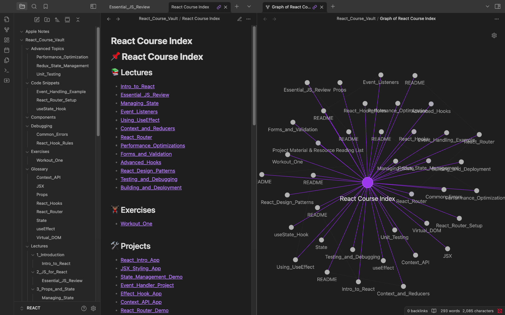

Below is a diff showing the updated Chapter 6 section. Only the folder & file structure block has changed, with the rest of the README.md left intact.

```diff
@@ **Chapter 6: Folder & File Structure** - Original @@
 Here’s a simplified overview:
 
 ```

-React_Course_Vault
-├─ Lectures
-│  ├─ 1_Introduction
-│  │   └─ Intro_to_React.md
-│  ├─ 2_JSX_and_Components
-│  │   └─ Understanding_JSX.md
-│  ├─ 3_Props_and_State
-│  │   └─ Managing_State.md
-│  ...
-│  └─ 13_Building_and-Deployment
-│      └─ Building_and_Deployment.md
-├─ Projects
-│  ├─ React_Intro_App
-│  │   └─ README.md
-│  ├─ JSX_Styling_App
-│  │   └─ README.md
-│  ...
-├─ Glossary
-├─ Code Snippets
-├─ Debugging
-├─ Advanced Topics
-└─ React Course Index.md
+React_Course_Vault
+├─ Advanced Topics
+│  ├─ Performance_Optimization.md
+│  ├─ Redux_State_Management.md
+│  └─ Unit_Testing.md
+├─ Code Snippets
+│  ├─ Event_Handling_Example.md
+│  ├─ React_Router_Setup.md
+│  └─ useState_Hook.md
+├─ Debugging
+│  ├─ Common_Errors.md
+│  └─ React_Hook_Rules.md
+├─ Glossary
+│  ├─ Context_API.md
+│  ├─ JSX.md
+│  ├─ Props.md
+│  ├─ React_Hooks.md
+│  ├─ React_Router.md
+│  ├─ State.md
+│  ├─ Virtual_DOM.md
+│  └─ useEffect.md
+├─ Lectures
+│  ├─ 1_Introduction
+│  │   └─ Intro_to_React.md
+│  ├─ 2_JSX_and_Components
+│  │   └─ Understanding_JSX.md
+│  ├─ 3_Props_and_State
+│  │   └─ Managing_State.md
+│  ├─ 4_Event_Handling
+│  │   └─ Event_Listeners.md
+│  ├─ 5_Effects_and_Lifecycle
+│  │   └─ Using_UseEffect.md
+│  ├─ 6_Context_and_Reducers
+│  │   └─ Context_and_Reducers.md
+│  ├─ 7_Routing
+│  │   └─ React_Router.md
+│  ├─ 8_Performance_Optimization
+│  │   └─ Performance_Optimizations.md
+│  ├─ 9_Forms_and_Validation
+│  │   └─ Forms_and_Validation.md
+│  ├─ 10_Advanced_Hooks
+│  │   └─ Advanced_Hooks.md
+│  ├─ 11_React_Design_Patterns
+│  │   └─ React_Design_Patterns.md
+│  ├─ 12_Testing_and_Debugging
+│  │   └─ Testing_and_Debugging.md
+│  └─ 13_Building_and_Deployment
+│      └─ Building_and_Deployment.md
+├─ Projects
+│  ├─ Context_API_App
+│  │   └─ README.md
+│  ├─ Effect_Hook_App
+│  │   └─ README.md
+│  ├─ Event_Handler_Project
+│  │   └─ README.md
+│  ├─ JSX_Styling_App
+│  │   └─ README.md
+│  ├─ React_Intro_App
+│  │   └─ README.md
+│  ├─ React_Performance_Toolkit
+│  │   └─ README.md
+│  ├─ React_Router_Demo
+│  │   └─ README.md
+│  └─ State_Management_Demo
+│      └─ README.md
+└─ React Course Index.md

 ```
```

If you prefer the full revised README.md, here’s the updated file with only the Chapter 6 section changed:

---

# React Course Vault Setup Script 1.0.0



**Chapters**  

1. [Introduction](#chapter-1-introduction)  
2. [Requirements & Prerequisites](#chapter-2-requirements--prerequisites)  
3. [Script Overview](#chapter-3-script-overview)  
4. [How to Use](#chapter-4-how-to-use)  
5. [Importing into Obsidian](#chapter-5-importing-into-obsidian)  
6. [Folder & File Structure](#chapter-6-folder--file-structure)  
7. [Customization](#chapter-7-customization)  
8. [Next Steps in Obsidian](#chapter-8-next-steps-in-obsidian)  
9. [Conclusion](#chapter-9-conclusion)

---

## **Chapter 1: Introduction**

This Bash script automates the process of creating a **structured folder system** for a React Course, including:

- **Lectures** (1 through 13), each with a sample `.md` file.
- **Projects** linking back to related lectures.
- **Glossary**, **Code Snippets**, **Debugging**, and **Advanced Topics** folders to keep your notes and references organized.
- A **React Course Index (MOC)** file for easy navigation within Obsidian.

Using this script will save you time and maintain a consistent layout so you can focus on **learning React** instead of file management.

---

## **Chapter 2: Requirements & Prerequisites**

- **Bash Environment**: Ensure you have Bash 3+ installed.  
  \- Most Linux and macOS systems come with it.  
  \- On Windows, use [Git Bash](https://gitforwindows.org/) or the Windows Subsystem for Linux (WSL).  
- **Obsidian**: Not strictly required for running the script, but highly recommended for the best note-taking experience. Download it from [Obsidian.md](https://obsidian.md).

---

## **Chapter 3: Script Overview**

1. **Creates a Root Folder** named `React_Course_Vault`.
2. **Generates Subfolders**:
   - **Lectures** (1–13)
   - **Projects**, **Glossary**, **Code Snippets**, **Debugging**, **Advanced Topics**
3. **Populates Sample Notes**:
   - Each **Lecture** folder has a `.md` file with placeholders for summary, key concepts, code examples, and related topics.
   - **Projects** folders each contain a `README.md` linking back to the relevant lecture.
   - **Glossary**, **Code Snippets**, **Debugging**, **Advanced Topics** have starter `.md` files.
4. **Index (MOC) File**: A master list (`React Course Index.md`) linking everything for quick reference.

---

## **Chapter 4: How to Use**

1. **Download/Copy** the script (e.g., `setup_react_vault.sh`) into a local directory.
2. **Make Executable**:

   ```bash
   chmod +x setup_react_vault.sh
   ```

3. **Run** the script:

   ```bash
   bash ./setup_react_vault.sh
   ```

   > On some systems, running `./setup_react_vault.sh` alone may default to `sh`—using `bash` ensures compatibility.
4. **Open** the generated folder **`React_Course_Vault`** to explore your newly created structure.

---

## **Chapter 5: Importing into Obsidian**

1. **Launch Obsidian** and select **Open folder as vault**.
2. **Navigate** to the `React_Course_Vault` folder.
3. **Enjoy** your structured React Course environment! You’ll see:
   - **Lectures** (1 through 13) with placeholders.
   - **Projects**, **Glossary**, **Code Snippets**, **Debugging**, **Advanced Topics**.
   - A convenient **`React Course Index.md`** to quickly find notes.

---

## **Chapter 6: Folder & File Structure**

Here’s a simplified overview:

```
React_Course_Vault
├─ Advanced Topics
│  ├─ Performance_Optimization.md
│  ├─ Redux_State_Management.md
│  └─ Unit_Testing.md
├─ Code Snippets
│  ├─ Event_Handling_Example.md
│  ├─ React_Router_Setup.md
│  └─ useState_Hook.md
├─ Debugging
│  ├─ Common_Errors.md
│  └─ React_Hook_Rules.md
├─ Glossary
│  ├─ Context_API.md
│  ├─ JSX.md
│  ├─ Props.md
│  ├─ React_Hooks.md
│  ├─ React_Router.md
│  ├─ State.md
│  ├─ Virtual_DOM.md
│  └─ useEffect.md
├─ Lectures
│  ├─ 1_Introduction
│  │   └─ Intro_to_React.md
│  ├─ 2_JSX_and_Components
│  │   └─ Understanding_JSX.md
│  ├─ 3_Props_and_State
│  │   └─ Managing_State.md
│  ├─ 4_Event_Handling
│  │   └─ Event_Listeners.md
│  ├─ 5_Effects_and_Lifecycle
│  │   └─ Using_UseEffect.md
│  ├─ 6_Context_and_Reducers
│  │   └─ Context_and_Reducers.md
│  ├─ 7_Routing
│  │   └─ React_Router.md
│  ├─ 8_Performance_Optimization
│  │   └─ Performance_Optimizations.md
│  ├─ 9_Forms_and_Validation
│  │   └─ Forms_and_Validation.md
│  ├─ 10_Advanced_Hooks
│  │   └─ Advanced_Hooks.md
│  ├─ 11_React_Design_Patterns
│  │   └─ React_Design_Patterns.md
│  ├─ 12_Testing_and_Debugging
│  │   └─ Testing_and_Debugging.md
│  └─ 13_Building_and_Deployment
│      └─ Building_and_Deployment.md
├─ Projects
│  ├─ Context_API_App
│  │   └─ README.md
│  ├─ Effect_Hook_App
│  │   └─ README.md
│  ├─ Event_Handler_Project
│  │   └─ README.md
│  ├─ JSX_Styling_App
│  │   └─ README.md
│  ├─ React_Intro_App
│  │   └─ README.md
│  ├─ React_Performance_Toolkit
│  │   └─ README.md
│  ├─ React_Router_Demo
│  │   └─ README.md
│  └─ State_Management_Demo
│      └─ README.md
└─ React Course Index.md
```

---

## **Chapter 7: Customization**

- **Rename Folders** to suit your course or preference.
- **Add/Remove Lectures** by adjusting the script and deleting or inserting files.
- **Expand Content**: Fill in placeholders with your own notes, code examples, or screenshots.
- **Tweak the Index**: Link additional resources or external documentation.

---

## **Chapter 8: Next Steps in Obsidian**

1. **Linking Notes**: Use `[[Double Brackets]]` to easily connect lectures, glossary terms, etc.
2. **Tagging**: Add `#React`, `#Hooks`, or `#Projects` in your notes for quick search.  
3. **Install Plugins**:
   - **Templater** for faster, more consistent note-taking.  
   - **(Optional) Another recommended plugin** for advanced note management—e.g., **"Canvas"** for a visual overview.  
4. **Capture Screens**: Make sure to **add screenshots** of your work or code snippets to enhance your learning and documentation.

---

## **Chapter 9: Conclusion**

You now have a **powerful, automated setup** to kick-start your React learning or teaching in Obsidian. Feel free to adapt, remix, or extend these notes to create a personalized environment.

> **Questions or suggestions?**  
> Don’t hesitate to reach out or customize this setup further!

---

## **Next Steps — To-Do List**

- **Add Screen Captures**: Document your folder structure and lectures visually.
- **Install Another Plugin**: **Canvas** or a similar plugin to map out React concepts visually.

**Happy Learning & Note-Taking!**
---
